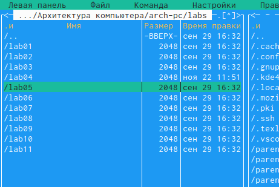
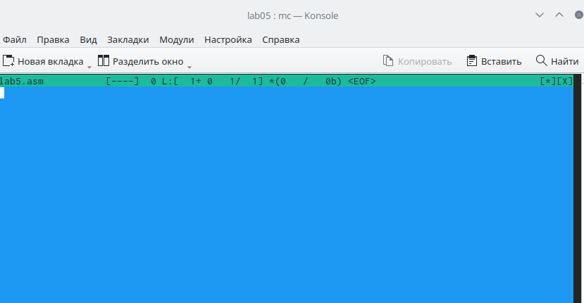
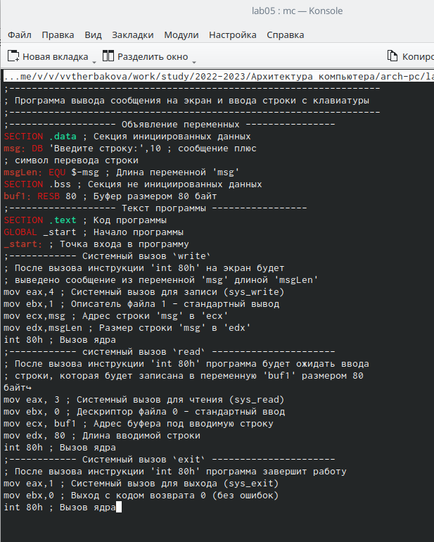
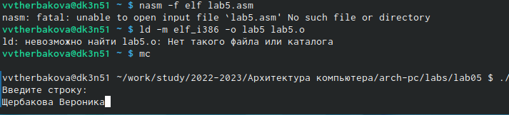
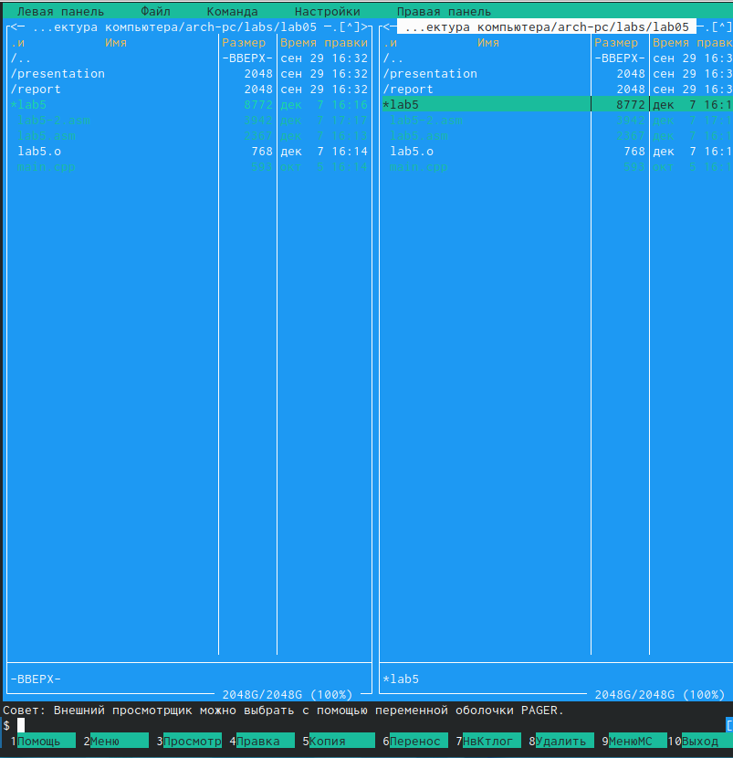
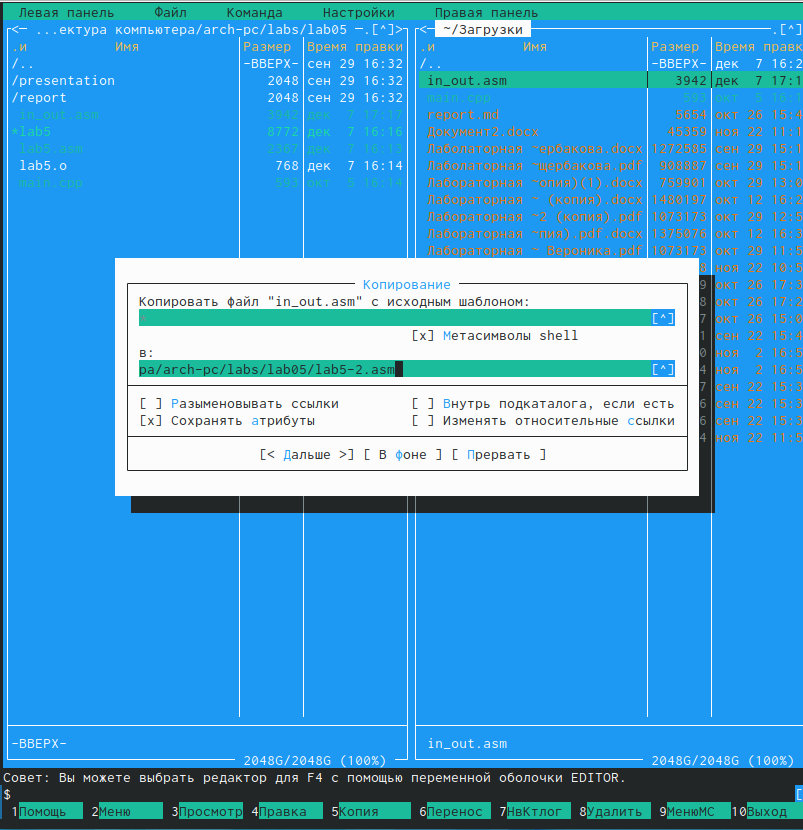
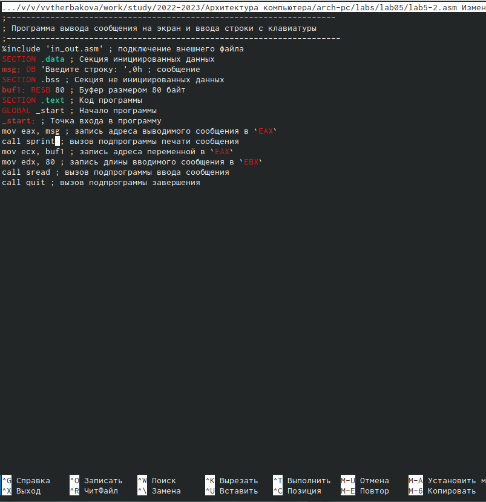

---
## Front matter
title: "Лабораторная Работа №5"
subtitle: "Архитектура Компьютеров"
author: "Щербакова Вероника Владимировна"

## Generic otions
lang: ru-RU
toc-title: "Содержание"

## Bibliography
bibliography: bib/cite.bib
csl: pandoc/csl/gost-r-7-0-5-2008-numeric.csl

## Pdf output format
toc: true # Table of contents
toc-depth: 2
lof: true # List of figures
lot: true # List of tables
fontsize: 12pt
linestretch: 1.5
papersize: a4
documentclass: scrreprt
## I18n polyglossia
polyglossia-lang:
  name: russian
  options:
	- spelling=modern
	- babelshorthands=true
polyglossia-otherlangs:
  name: english
## I18n babel
babel-lang: russian
babel-otherlangs: english
## Fonts
mainfont: PT Serif
romanfont: PT Serif
sansfont: PT Sans
monofont: PT Mono
mainfontoptions: Ligatures=TeX
romanfontoptions: Ligatures=TeX
sansfontoptions: Ligatures=TeX,Scale=MatchLowercase
monofontoptions: Scale=MatchLowercase,Scale=0.9
## Biblatex
biblatex: true
biblio-style: "gost-numeric"
biblatexoptions:
  - parentracker=true
  - backend=biber
  - hyperref=auto
  - language=auto
  - autolang=other*
  - citestyle=gost-numeric
## Pandoc-crossref LaTeX customization
figureTitle: "Рис."
tableTitle: "Таблица"
listingTitle: "Листинг"
lofTitle: "Список иллюстраций"
lotTitle: "Список таблиц"
lolTitle: "Листинги"
## Misc options
indent: true
header-includes:
  - \usepackage{indentfirst}
  - \usepackage{float} # keep figures where there are in the text
  - \floatplacement{figure}{H} # keep figures where there are in the text
---

# Цель работы

Приобрести практические навыки работы в Midnight Commander. Освоить инструкции языка ассемблера mov и int.

# Задание

# Теоретическое введение

# Выполнение лабораторной работы

1. Откроем Midnight Commander:(рис. [-@fig:001])
2. Пользуясь клавишами ↑ , ↓ и Enter переходим в каталог ~/work/arch-pc созданный при выполнении лабораторной работы №5:
3. С помощью функциональной клавиши F7 создаём папку lab05 (рис. 5.3) и переходим в созданный каталог:
{ #fig:001 width=90% }
4. Пользуясь строкой ввода и командой touch создаём файл lab5.asm:
{ #fig:002 width=90% }
5. С помощью функциональной клавиши F4 открываем файл lab5.asm. Как правило в качестве встроенного редактора Midnight Commander используется редакторы nano:
6. Вводим текст программы из листинга 5.1, сохраняем изменения и закрываем файл и проверяем,что бы он сохранился:
{ #fig:003 width=90% }
7. Оттранслируем текст программы lab5.asm в объектный файл. Выполняем компоновку объектного файла и запускаем получившийся исполняемый файл. Программа выведет строку 'Введите строку:' и будет ожидать ввода с клавиатуры. На запрос вводим свои ФИО:
{ #fig:004 width=90% }
8. Скачиваем файл in_out.asm со страницы курса в ТУИС:
9. Подключаемый файл in_out.asm должен лежать в том же каталоге, что и файл с программой, в которой он используется:
{ #fig:005 width=90% }
10. С помощью функциональной клавиши F6 создаём копию файла lab5-.asm с именем lab5-2.asm. Выделяем файл lab5.asm, нажатием на клавишу F6 , вводим имя файла lab6-2.asm и нажимаем на клавишу Enter:
{ #fig:006 width=90% }
11. Исправляем текст программы в файле lab5-2.asm с использованием подпрограмм из внешнего файла in_out.asm. Создаём исполняемый файл и проверяем его работу:
{ #fig:007 width=90% }
# Выводы

Приобрели практические навыки работы в Midnight Commander. Освоили
инструкции языка ассемблера mov и int.
# Список литературы{.unnumbered}

::: {#refs}
:::
