xxxxx---
## Front matter
title: "Архитектура компьютера"
subtitle: "Лабораторная №6"
author: "Щербакова Вероника НБИбд-03-22"

## Generic otions
lang: ru-RU
toc-title: "Отчет по лабораторной №6"

## Bibliography
bibliography: bib/cite.bib
csl: pandoc/csl/gost-r-7-0-5-2008-numeric.csl

## Pdf output format
toc: true # Table of contents
toc-depth: 2
lof: true # List of figures
lot: true # List of tables
fontsize: 12pt
linestretch: 1.5
papersize: a4
documentclass: scrreprt
## I18n polyglossia
polyglossia-lang:
  name: russian
  options:
	- spelling=modern
	- babelshorthands=true
polyglossia-otherlangs:
  name: english
## I18n babel
babel-lang: russian
babel-otherlangs: english
## Fonts
mainfont: PT Serif
romanfont: PT Serif
sansfont: PT Sans
monofont: PT Mono
mainfontoptions: Ligatures=TeX
romanfontoptions: Ligatures=TeX
sansfontoptions: Ligatures=TeX,Scale=MatchLowercase
monofontoptions: Scale=MatchLowercase,Scale=0.9
## Biblatex
biblatex: true
biblio-style: "gost-numeric"
biblatexoptions:
  - parentracker=true
  - backend=biber
  - hyperref=auto
  - language=auto
  - autolang=other*
  - citestyle=gost-numeric
## Pandoc-crossref LaTeX customization
figureTitle: "Рис."
tableTitle: "Таблица"
listingTitle: "Листинг"
lofTitle: "Список иллюстраций"
lotTitle: "Список таблиц"
lolTitle: "Листинги"
## Misc options
indent: true
header-includes:
  - \usepackage{indentfirst}
  - \usepackage{float} # keep figures where there are in the text
  - \floatplacement{figure}{H} # keep figures where there are in the text
---

# Цель работы

Освоение арифметических инструкций языка ассемблера NASM

# Задание

Написать программу вычисления выражения 𝑦 = 𝑓(𝑥). Программа должна
выводить выражение для вычисления, выводить запрос на ввод значения
𝑥, вычислять заданное выражение в зависимости от введенного 𝑥, выво-
дить результат вычислений. Вид функции 𝑓(𝑥) выбрать из таблицы 6.3
вариантов заданий в соответствии с номером полученным при выполне-
нии лабораторной работы. Создайте исполняемый файл и проверьте его
работу для значений 𝑥1 и 𝑥2 из 6.3.

# Теоретическое введение

# Выполнение лабораторной работы
1. Создадим каталог для программам лабораторной работы №6, перейдем в
него и создадим файл lab6-1.asm:
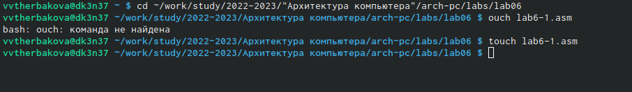{ #fig:001 width=90% }
2. Введем в файл lab6-1.asm текст программы из листинга 6.1:
{ #fig:002 width=90% }
{ #fig:003 width=90% }
3. Создадим исполняемый файл и запустим его: вывод j
{ #fig:004 width=90% }
4. Далее изменим текст программы и вместо символов, запишем в реги-
стры числа. Исправим текст программы (Листинг 1) : вывода нет(пустота)
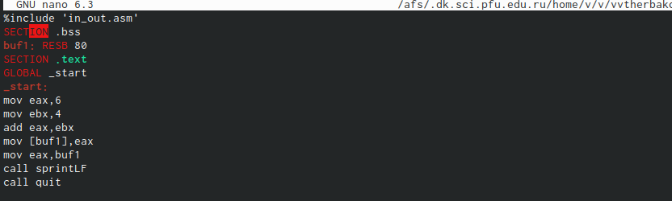{ #fig:005 width=90% }
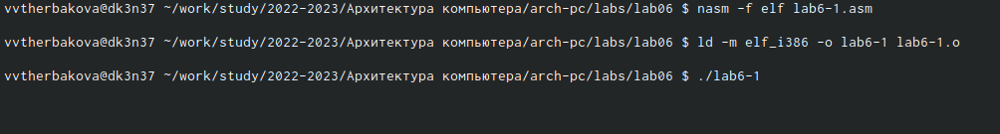{ #fig:006 width=90% }
5. Создаем файл lab6-2.asm в каталоге ~/work/arch-pc/lab06 и введите в него
текст программы из листинга 6.2:
Описываются проведённые действия, в качестве иллюстрации даётся ссылка на иллюстрацию (рис. [-@fig:001])
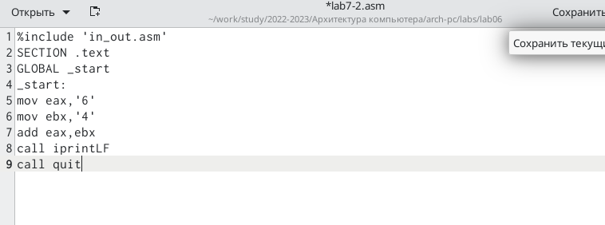{ #fig:007 width=90% }
6. Создем исполняемый файл и запускаем его: вывод 106
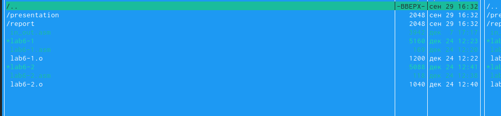{ #fig:008 width=90% }
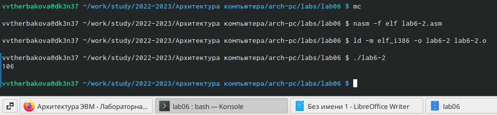{ #fig:009 width=90% }
7. Заменим строки: отличий нет.
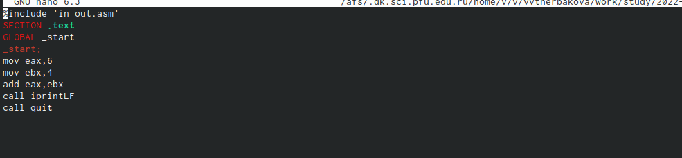{ #fig:010 width=90% }
8. Создадим исполняемый файл и запустим его: вывод 10
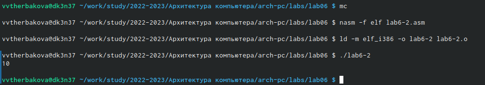{ #fig:011 width=90% }
9. Заменим функцию iprintLF на iprint. Создаем исполняемый файл и запу-
скаем его:
{ #fig:012 width=90% }
{ #fig:013 width=90% }
10. Создайте файл lab6-3.asm в каталоге ~/work/arch-pc/lab06.В качестве примера выполнения арифметических операций в NASM приведем программу вычисления арифметического выражения:
{ #fig:014 width=90% }
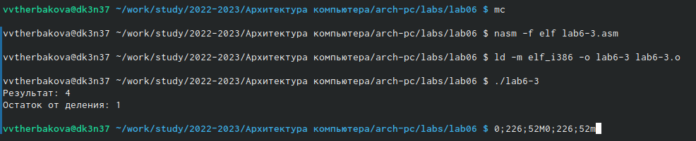{ #fig:015 width=90% }
11. В качестве другого примера рассмотрим программу вычисления варианта задания по номеру студенческого билета, работающую по следующему алгоритму:
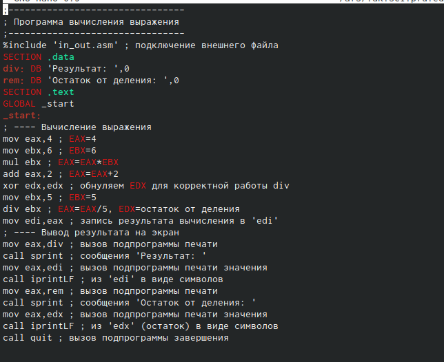{ #fig:016 width=90% }
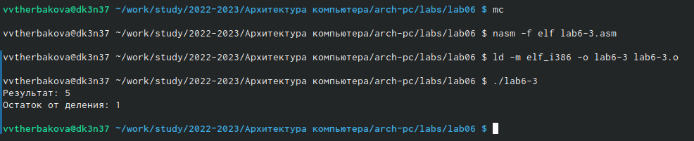{ #fig:017 width=90% }
12. Создайте файл,Внимательно изучите текст программы из листинга 6.4 и введите в файл variant.asm:
13. В качестве другого примера рассмотрим программу вычисления варианта:
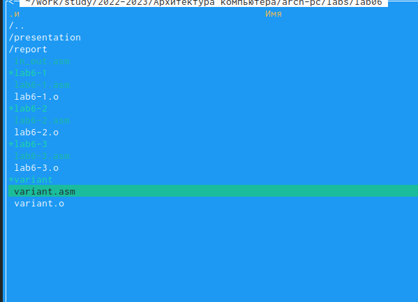{ #fig:018 width=90% }
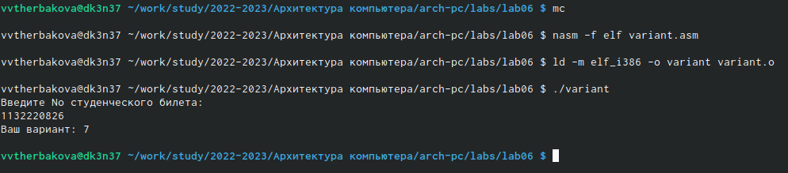{ #fig:019 width=90% }
14. Самостоятельная работа:
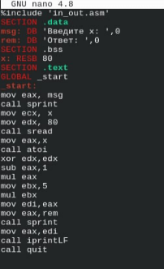{ #fig:020 width=90% }
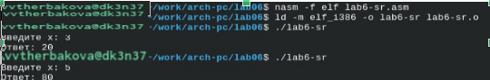{ #fig:021 width=90% }

# Выводы

Освоила арифметические инструкции языка ассемблера NASM.

# Список литературы{.unnumbered}

::: {#refs}
:::
